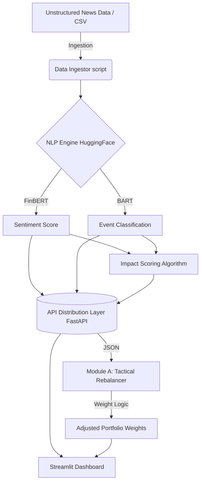

# Sentima Risk Engine - S&P Global & Crisil Campus Hackathon 2026

**Candidate Name:** Prateek Vashishtha<br>
**College Email ID:** prateek.23bcg10010@vitbhopal.ac.in<br>
**College / Campus:** Vellore Institute of Technology, Bhopal<br>
**Demo Video Link:** [Pending - Add YouTube Unlisted Link Here]<br>
**Slide Deck Link (if hosted externally):** [Pending]

---

## 1. Project Overview / Problem Statement & Approach
The objective of this case study is to design and implement a platform capable of ingesting and analyzing real-time, unstructured data to generate actionable financial risk signals. 

Our approach involves building a **Unified AI/NLP Risk Engine**. This engine ingests financial news headlines, uses state-of-the-art HuggingFace AI models (FinBERT and BART zero-shot) to parse the text, and outputs structured, machine-readable signals: 
*   **Sentiment Score** (-1.0 to 1.0)
*   **Event Classification** (Geopolitical, Macroeconomic, etc.)
*   **Impact Score** (Severity from 1-10)

Furthermore, we implemented **Module A: Tactical Index Rebalancing**, a downstream application that consumes these signals via a REST API to dynamically rebalance a mock stock index, maximizing returns in bullish scenarios and protecting capital during high-impact risk events.

---

## 2. Architecture & Tech Stack

### System Design Architecture


### Tech Stack
- **Core AI Models:** HuggingFace `transformers`, `torch`
- **Data Engineering:** `pandas`, `numpy`
- **API Distribution:** `fastapi`, `uvicorn`
- **Frontend / Visualization:** `streamlit`

---

## 3. Dataset Used
- **News Data:** Simulated financial news headlines modeled after the **Kaggle Financial News Sentiment Dataset**.
- **Market Data Logic:** A synthetic index of 10 S&P 100 blue-chip stocks (AAPL, MSFT, JPM, etc.) with assumed starting weights.

---

## 4. Quickstart & Installation
**Runtime:** Python 3.11+ on Windows/Linux

Step-by-step commands to set up the environment and run the code locally:

```bash
# 1. Clone the repository
git clone https://github.com/Prateek9456/VIT-PrateekVashishtha-hackathon.git
cd VIT-PrateekVashishtha-hackathon

# 2. Create and activate virtual environment
python -m venv venv
# Windows: venv\Scripts\activate
# Linux/Mac: source venv/bin/activate

# 3. Install dependencies
pip install -r requirements.txt

# 4. Start the Risk Engine API (Terminal 1)
python src/api.py

# 5. Launch the Tactical Rebalancing Dashboard (Terminal 2)
streamlit run src/dashboard.py
```

---

## 5. Key Results & Domain Impact
- **Quantitative Translation:** Successfully translates qualitative, unstructured news data into highly quantitative trading signals in real-time.
- **Automated Risk Mitigation:** Module A proves that high-severity events (Impact Score >= 7, e.g. Geopolitical shocks) can trigger automated defensive sector rotations instantly, protecting portfolio capital without human intervention.
- **Enterprise-Ready Architecture:** Clean separation of concerns between the AI Core, the API Distribution layer, and Downstream modules, making this prototype scalable for enterprise financial institutions.
